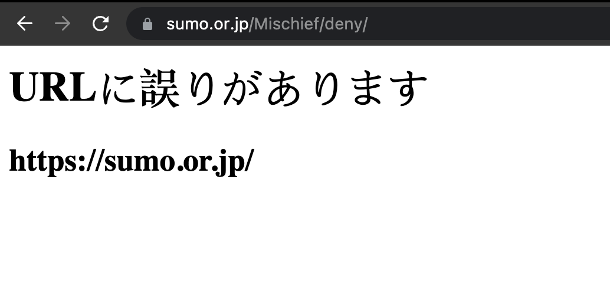

# mischief
🥸 Experimental single-page web archiving solution using Playwright.




Relies mainly [on network interception](https://playwright.dev/docs/network#network-events), uses browser scripts and out-of-browser capture as a fallback for resources that cannot be captured otherwise.

```javascript
import { Mischief } from "mischief";

const myCapture = new Mischief("https://example.com");
await myCapture.capture();
const myArchive = await myCapture.toWarc(gzip=true);
```

> 🚧 Work in progress.

---

## Prototype goals

### Limits
- [x] Limit capture time in seconds, and set timeouts for each stage.
- [x] Limit total size of the resources collection in (kilo)bytes.
- [x] Allow to keep partially captured resources.

### Browser scripts
- [x] Listing of responsive images (`img[srcset]`) for out-of-browser capture
- [x] Listing of stylesheets for out-of-browser capture
- [x] Listing of audio and video sources for out-of-browser capture
- [x] Auto play media
- [x] Auto scroll
- [ ] Grab `@font-face` references
- [ ] Per-website scripts
  - [ ] _(As necessary to cover playback edge cases_)

### Security
- [x] New browser context for each capture _(incognito mode)_ 
- [x] Only allow `http:` or `https:` as principal capture urls
- [ ] Block list of domains, protocols, urls and IP ranges the browser should not be able to access
- [ ] Prevent harmful redirects _(i.e: redirect to `file://`)_

### Misc
- [x] Full page screenshots, added to the archive as `file:///screenshot.png`.

### Export formats
- [x] `.warc`
- [x] `.warc.gz`
- [ ] `.wacz` _(unsigned)_
- [ ] `.wacz` _(signed)_
- [ ] ~`.wbn`~ _(later, optional)_

## Playback
> Current focus
- [ ] Fully functional YouTube playbacks:
  - At the moment, the video stops after a few seconds. Resources seem to be captured.
  - Clue: See how the `.warc` in `warcembed-demo.s3.amazonaws.com/youtube.com-2020-09-03.wacz` looks different. It seems that the [status line](https://github.com/webrecorder/warcio.js/blob/32d62bf39cdbff0c68c523a192c793e33504101d/src/warcrecord.js#L27) is rewritten in a way to give `<replay-web-page>` clues as to how to interpret it.  
- [ ] Functional Twitter Videos playback:
  - May require additional browser script.
  - Clues from YouTube playback bug may apply.
- [ ] Functional TikTok captures and playbacks
  - We're likely identified as bots
  - Clues from YouTube playback bug may apply.
- [ ] Functional Instagram playbacks
  - Video doesn't playback

### Other Known issues
> Note: A lot of these issues appeared as I added _requests_ to WARCs.
- [ ] Fonts sometimes don't get downloaded or played back correctly
- [ ] Using incognito mode _(Playwright contexts)_ seems to be triggering bot detection scripts
  - Can this be avoided?
- [x] CDX rewriting quirks:
  - When capturing `https://lil.law.harvard.edu`, the root url is rewritten as `https://lil.law.harvard.edu/?__wb_method=HTTP/1.1&__wb_post_data=`
- [ ] Screenshots sometimes come back empty

---

## Local setup
- Requires [Node 18+](https://nodejs.org/en/)
- Install dependencies: `npm install`
- You may need to install Playwright manually: `npm i -D playwright`
- Get started by having a look and running `example.js`
