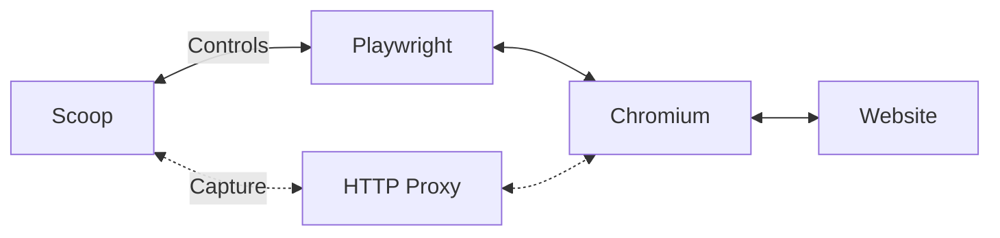
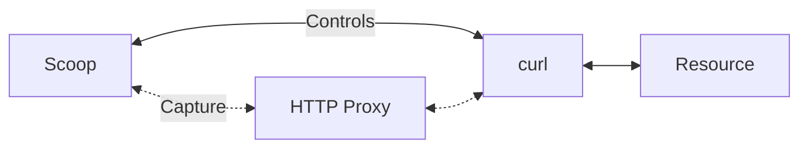

# Scoop 🍨

[](https://badge.fury.io/js/@harvard-lil%2Fscoop) [](https://standardjs.com) [](https://github.com/harvard-lil/scoop/actions/workflows/lint.yml) [](https://github.com/harvard-lil/scoop/actions/workflows/test.yml)

High-fidelity, browser-based, single-page web archiving library and CLI. 

**Use it in the terminal...**
```bash
scoop "https://lil.law.harvard.edu"
```

**... or in your Node.js project**
```javascript
import { Scoop } from '@harvard-lil/scoop'

const capture = await Scoop.capture('https://lil.law.harvard.edu')
const wacz = await capture.toWACZ()
```

<a href="https://tools.perma.cc"></a>

---

## Summary
- [About](#about)
- [Main Features](#main-features)
- [Getting Started](#getting-started)
- [Using Scoop on the command line](#using-scoop-on-the-command-line)
- [Using Scoop as a JavaScript library](#using-scoop-as-a-javascript-library)
- [Development](#development)
- [FAQ](#faq)

---

## About

**Scoop** is a high fidelity, browser-based, web archiving capture engine from the [Harvard Library Innovation Lab](https://lil.law.harvard.edu). 

Fine-tune this custom web capture software to create robust single-page captures of the internet with accurate and complete **provenance information**. 

With extensive options for asset formats and inclusions, Scoop will create **.warc**, **warc.gz** or **.wacz** files to be stored by users and replayed using the web archive replay software of their choosing.

Scoop also comes with built-in support for the [WACZ Signing and Verification specification](https://specs.webrecorder.net/wacz-auth/0.1.0/), 
allowing users to cryptographically sign their captures. 

[👆 Back to the summary](#summary)

---

## Main Features
- High-fidelity, browser-based capture of singular web pages with no alterations
- Highly configurable
- Optional attachments: 
  - Provenance summary
  - Screenshot
  - Extracted videos with associated subtitles and metadata
  - PDF snapshot
  - DOM snapshot
- Support for `.warc.`, `.warc.gz` and `.wacz` output formats
  - Support for the [WACZ Signing and Verification specification](https://specs.webrecorder.net/wacz-auth/0.1.0/)
  - Optional preservation of _"raw"_ exchanges in WACZ files for later analysis or reprocessing _("wacz with raw exchanges"_)

### Examples and screenshots
- 💾 [Sample WACZ file captured with Scoop](/.github/assets/example.wacz?raw=true).<br>
Playback software such as [replayweb.page](https://replayweb.page/) can be used to explore this sample capture.
- 📷 [Entry points](/.github/assets/screenshot-entry-points.png?raw=true)
- 📷 [Web Capture](/.github/assets/screenshot-web-capture.png?raw=true)
- 📷 [Provenance Summary](/.github/assets/screenshot-provenance-summary.png?raw=true)
- 📷 [PDF Snapshot](/.github/assets/screenshot-pdf-snapshot.png?raw=true)
- 📷 Embedded videos as attachments [[1]](/.github/assets/screenshot-video-as-attachment-1.png?raw=true) [[2]](/.github/assets/screenshot-video-as-attachment-2.png?raw=true)

[👆 Back to the summary](#summary)

---

## Getting started

### Dependencies 
**Scoop** requires [Node.js 18+](https://nodejs.org/en/). 

Other _recommended_ system-level dependencies: 
[curl](https://curl.se/), [python3](https://www.python.org/) (for `--capture-video-as-attachment` option).

### Compatibility
This program has been written for UNIX-like systems and is expected to work on **Linux, Mac OS, and Windows Subsystem for Linux**.

### Installation

**Scoop** is available on [npmjs.org](https://www.npmjs.com/package/@harvard-lil/scoop) and can be installed as follows:
 
```bash
# As a CLI
npm install -g @harvard-lil/scoop

# As a library
npm install @harvard-lil/scoop --save

# In both cases, you may need to install Playwright's dependencies: 
sudo npx playwright install-deps chromium
```

<details>
  <summary><strong>Trouble installing the CLI?</strong></summary>


- Make sure you are running Node JS 18+ (`node -v`)
- Permissions issues are a common when installing `npm` packages globally for the first time. 
See [npm's documentation](https://docs.npmjs.com/resolving-eacces-permissions-errors-when-installing-packages-globally) for solutions.
- On certain systems, using `install-deps` without the `chromium` argument might be necessary:
```bash
sudo npx playwright install-deps
```
- [npx may be used](https://docs.npmjs.com/cli/v9/commands/npx) as an alternative to a global installation:
```bash
# In a new folder
npm init
npm install @havard-lil/scoop
npx scoop "https://example.com"
```
</details>


[👆 Back to the summary](#summary)

---

## Using Scoop on the command line

Here are a few examples of how the `scoop` command can be used to make a customized capture of a web page.

```bash
# This will capture a given url using the default settings.
scoop "https://lil.law.harvard.edu" 

# Unless specified otherwise, scoop will save the output of the capture as "./archive.wacz".
# We can change this with the `--output` / `-o` option
scoop "https://lil.law.harvard.edu" -o my-collection/lil.wacz

# But what if I want to change the output format itself?
scoop "https://lil.law.harvard.edu" -f warc -o my-collection/lil.warc

# By default, Scoop runs in headless mode. 
# I can turn the "headless" flag off to see what happens in Chromium during capture.
scoop "https://lil.law.harvard.edu" --headless false

# Although it comes with "good defaults", scoop is highly configurable ...
# timeout-related options are good 
scoop "https://lil.law.harvard.edu" --capture-video-as-attachment false --screenshot false --capture-window-x 320 --capture-window-y 480 --capture-timeout 30000 --max-capture-size 100000 --signing-url "https://example.com/sign"

# ... use --help to list the available options, and see what the defaults are.
scoop --help

# Timeout-related options are good dials to turn first when trying to customize "how much" of a page to capture.
scoop "https://lil.law.harvard.edu" --capture-timeout 90000 --load-timeout 60000 --network-idle-timeout 30000
```

<details>
  <summary><strong>See: Output of scoop --help 🔍</strong></summary>

```
Usage: scoop [options] <url>

🍨 High-fidelity, browser-based, single-page web archiving library and CLI.
More info: https://github.com/harvard-lil/scoop

Options:
  -v, --version                                          Display Scoop and Scoop CLI version.
  -o, --output <string>                                  Output path. (default: "./archive.wacz")
  -f, --format <string>                                  Output format. (choices: "warc", "warc-gzipped", "wacz", "wacz-with-raw", default: "wacz")
  --signing-url <string>                                 Authsign-compatible endpoint for signing WACZ file.
  --signing-token <string>                               Authentication token to --signing-url, if needed.
  --screenshot <bool>                                    Add screenshot step to capture? (choices: "true", "false", default: "true")
  --pdf-snapshot <bool>                                  Add PDF snapshot step to capture? (choices: "true", "false", default: "false")
  --dom-snapshot <bool>                                  Add DOM snapshot step to capture? (choices: "true", "false", default: "false")
  --capture-video-as-attachment <bool>                   Add capture video(s) as attachment(s) step to capture? (choices: "true", "false", default: "true")
  --capture-certificates-as-attachment <bool>            Add capture certificate(s) as attachment(s) step to capture? (choices: "true", "false", default: "true")
  --provenance-summary <bool>                            Add provenance summary to capture? (choices: "true", "false", default: "true")
  --attachments-bypass-limits <bool>                     If active, attachments will not count towards time and size constraints imposed on capture (--capture-timeout, --max--capture-size).
                                                         (choices: "true", "false", default: "true")
  --capture-timeout <number>                             Maximum time allocated to capture process before hard cut-off, in ms. (default: 60000)
  --load-timeout <number>                                Max time Scoop will wait for the page to load, in ms. (default: 20000)
  --network-idle-timeout <number>                        Max time Scoop will wait for the in-browser networking tasks to complete, in ms. (default: 20000)
  --behaviors-timeout <number>                           Max time Scoop will wait for the browser behaviors to complete, in ms. (default: 20000)
  --capture-video-as-attachment-timeout <number>         Max time Scoop will wait for the video capture process to complete, in ms. (default: 30000)
  --capture-certificates-as-attachment-timeout <number>  Max time Scoop will wait for the certificates capture process to complete, in ms. (default: 10000)
  --capture-window-x <number>                            Width of the browser window Scoop will open to capture, in pixels. (default: 1600)
  --capture-window-y <number>                            Height of the browser window Scoop will open to capture, in pixels. (default: 900)
  --max-capture-size <number>                            Size limit for the capture's exchanges list, in bytes. (default: 209715200)
  --auto-scroll <bool>                                   Should Scoop try to scroll through the page? (choices: "true", "false", default: "true")
  --auto-play-media <bool>                               Should Scoop try to autoplay `<audio>` and `<video>` tags? (choices: "true", "false", default: "true")
  --grab-secondary-resources <bool>                      Should Scoop try to download img srcsets and secondary stylesheets? (choices: "true", "false", default: "true")
  --run-site-specific-behaviors <bool>                   Should Scoop run site-specific capture behaviors? (via: browsertrix-behaviors) (choices: "true", "false", default: "true")
  --headless <bool>                                      Should Chrome run in headless mode? (choices: "true", "false", default: "true")
  --user-agent-suffix <string>                           If provided, will be appended to Chrome's user agent. (default: "")
  --blocklist <string>                                   If set, replaces Scoop's default list of url patterns and IP ranges Scoop should not capture. Coma-separated. Example:
                                                         "/https?://localhost/,0.0.0.0/8,10.0.0.0".
  --intercepter <string>                                 ScoopIntercepter class to be used to intercept network exchanges. (default: "ScoopProxy")
  --proxy-host <string>                                  Hostname to be used by Scoop's HTTP proxy. (default: "localhost")
  --proxy-port <string>                                  Port to be used by Scoop's HTTP proxy. (default: 9000)
  --proxy-verbose <bool>                                 Should Scoop's HTTP proxy output logs to the console? (choices: "true", "false", default: "false")
  --public-ip-resolver-endpoint <string>                 API endpoint to be used to resolve the client's IP address. Used in the context of the provenance summary. (default: "https://icanhazip.com")
  --yt-dlp-path <string>                                 Path to the yt-dlp executable. Used for capturing videos. (default: "[library]/executables/yt-dlp")
  --crip-path <string>                                   Path to the crip executable. Used for capturing SSL/TLS certificates. (default: "[library]/executables/crip")
  --log-level <string>                                   Controls Scoop CLI's verbosity. (choices: "silent", "trace", "debug", "info", "warn", "error", default: "info")
  -h, --help                                             Show options list.
```
</details>


[👆 Back to the summary](#summary)

---

## Using Scoop as a JavaScript library

**Scoop** can be used as a library in a Node.js project. 
Here are a few examples of how to programmatically capture web pages using the `Scoop.capture()` method, which returns [an instance of the `Scoop` class](https://github.com/harvard-lil/scoop/blob/main/Scoop.js). 

```javascript
const capture = await Scoop.capture(url, options)
```

### Quick access
- [List of available options for `Scoop.capture()`](https://github.com/harvard-lil/scoop/blob/main/options.types.js)
- [`Scoop.toWACZ()` method](https://github.com/harvard-lil/scoop/blob/main/Scoop.js#L1138)
- [`Scoop.toWARC()` method](https://github.com/harvard-lil/scoop/blob/main/Scoop.js#L1126)
- [`Scoop.fromWACZ()` method (experimental)](https://github.com/harvard-lil/scoop/blob/main/Scoop.js#L1117)
- [Possible values of the `Scoop.state` property](https://github.com/harvard-lil/scoop/blob/main/Scoop.js#L45)


### Example: Capture with default settings
```javascript
import fs from 'fs/promises'
import { Scoop } from '@harvard-lil/scoop'

try {
  const capture = await Scoop.capture('https://lil.law.harvard.edu')
  const wacz = await capture.toWACZ()
  await fs.writeFile('archive.wacz', Buffer.from(wacz))
} catch(err) {
  // ...
}
```

### Example: Capture with custom settings
```javascript
import fs from 'fs/promises'
import { Scoop } from '@harvard-lil/scoop'

try {
  const capture = await Scoop.capture('https://lil.law.harvard.edu', {
    screenshot: true,
    pdfSnapshot: true,
    captureVideoAsAttachment: false,
    captureTimeout: 120 * 1000,
    loadTimeout: 60 * 1000,
    captureWindowX: 320,
    captureWindowY: 480
  })

  const warc = await capture.toWARC()
  await fs.writeFile('archive.warc', Buffer.from(warc))
} catch(err) {
  // ...
}
```

### Example: Working with a copy of default settings
```javascript
import { Scoop } from '@harvard-lil/scoop'

try {
  // "options" will be a copy of Scoop's default settings
  const options = Scoop.defaults

  // It therefore becomes easier to inspect said defaults ...
  console.log(options)

  // ... and edit existing values
  options.pdfSnapshot = true
  options.blocklist.push('/https?:\/\/foo/')

  const capture = Scoop.capture('https://lil.law.harvard.edu', options)

  // ...
} catch(err) {
  // ...
}
```

### Example: Using a signing server
```javascript
import fs from 'fs/promises'
import { Scoop } from '@harvard-lil/scoop'

try {
  const capture = await Scoop.capture('https://lil.law.harvard.edu')

  const signedWacz = await capture.toWACZ(true, {
    url: 'https://example.com/sign',
    token: 'some-very-secret-token'
  })

  await fs.writeFile('archive.wacz', Buffer.from(signedWacz))
} catch(err) {
  // ...
}
```

[👆 Back to the summary](#summary)

---

## FAQ

> 🚧 Under construction

### What does "browser-based" capture mean? Is it using _my_ browser?

Browser-based capture means that Scoop uses a browser - [Chromium](https://www.chromium.org/Home/) - to visit the web page to capture and collect resources. 

Specifically, it uses an HTTP proxy to _"intercept"_ network exchanges as early as possible and preserve them _"as is"_.



The browser Scoop controls was installed specifically for programmatic access by [Playwright](https://playwright.dev), the underlying tool it uses to communicate with it, and is different from the default browser of the machine Scoop is running on. 
Additionally, Scoop creates a single-use, isolated browsing context for every capture it makes.

**More info:**
- https://playwright.dev/docs/browsers
- https://playwright.dev/docs/api/class-browsercontext

### Can I capture content behind login / password with Scoop? 

Not yet - for security reasons - but we're working on it. 

Although Playwright [supports loading browser profiles](https://playwright.dev/docs/api/class-browsertype#browser-type-launch-persistent-context) doing so:
- Breaks context isolation
- May lead to the presence of credentials / tokens in the captured exchanges

Help us design this feature: https://github.com/harvard-lil/scoop/issues/118

### Does Scoop capture _everything_ through a browser?

Yes, and unless specified otherwise.

Namely:
- If the main URL to capture is _not_ a web page _(for example: a PDF file)_, it will be captured using [curl](https://curl.se/).
- Videos captured as attachments are captured outside of the browser using [yt-dlp](https://github.com/yt-dlp/yt-dlp).
- Same goes for certificates, captured as attachments via [crip](https://github.com/Hakky54/certificate-ripper).
- Favicons may be captured out-of-band using [curl](https://curl.se/), if not intercepted during capture.

Exchanges captured in that context still go through Scoop's HTTP proxy, with the exception of _crip_.



### What is "WACZ with RAW exchanges"?

The `includeRaw` option of `Scoop.toWACZ()` allows for adding a folder named _"raw"_ in the WACZ file, which contains a copy of unprocessed HTTP exchanges coming directly from Scoop's HTTP proxy.

This feature may be used to preserve finer elements that would otherwise be lost, such as ill-formed HTTP headers, and could be relevant in certain contexts such as forensic analysis.

In order to prevent unnecessary use of storage, Scoop only keeps in _"/raw"_ the contents of exchanges it assesses are presented differently in WARCs. 
In practice, this most often means the bodies of HTTP exchanges are not included in the _"/raw"_ files because the WARCs already contain the same data.

**Experimental:** WACZ files stored with the `includeRaw` option can be ingested by Scoop for analysis and processing via the `Scoop.fromWACZ()` method.

### Should I run Scoop in headful mode?

In certain cases, running Scoop in _"headful"_ mode might yield better results. 

Passing `--headless false` to the CLI or `{ headless: false }` to the library will instruct **Scoop** to run **Chromium** in headful mode.

Simulating a graphical output is necessary when running **Scoop** in headful mode on a server. The following command can be used for that purpose:

```bash
xvfb-run --auto-servernum -- scoop "https://lil.law.harvard.edu" --headless false
```

[👆 Back to the summary](#summary)

---

## Development

### Standard JS
This codebase uses the [Standard JS](https://standardjs.com/) coding style. 
- `npm run lint` can be used to check formatting.
- `npm run lint-autofix` can be used to check formatting _and_ automatically edit files accordingly when possible.
- Most IDEs can be configured to automatically check and enforce this coding style.

### JSDoc
[JSDoc](https://jsdoc.app/) is used for both documentation and loose type checking purposes on this project.

### Testing
This project uses [Node.js' built-in test runner](https://nodejs.org/api/test.html).

```bash
npm run test
```

#### Tests-specific environment variables
The following environment variables allow for testing features requiring access to a third-party server. 

These are optional, and can be added to a local `.env` file which will be automatically interpreted by the test runner. 

| Name | Description |
| --- | --- |
| `TEST_WACZ_SIGNING_URL` | URL of an [authsign-compatible endpoint](https://github.com/webrecorder/authsign) for signing WACZ files.<br>To run such an endpoint locally, use `npm run dev-signer`, which will overwrite `.env` and set this variable to `http://localhost:5000/sign`; see [.services/signer](.services/signer).|
| `TEST_WACZ_SIGNING_TOKEN` | If required by the server at `TEST_WACZ_SIGNING_URL`, an authentication token. |

### Available CLI

```bash
# Runs test suite
npm run test

# Runs linter
npm run lint

# Runs linter and attempts to automatically fix issues
npm run lint-autofix

# Runs a local instance of wacz-signer for test purposes (see "Testing" section)
npm run dev-signer

# Step-by-step NPM publishing helper
npm run publish-util
```

[👆 Back to the summary](#summary)
