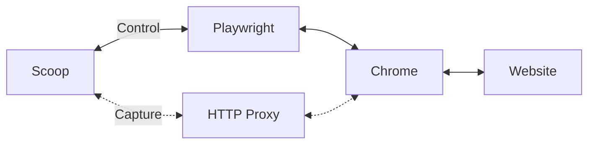

> 🚧 🚧 🚧

# Perma Scoop 🍨

High-fidelity, browser-based, single-page web archiving library. 

By the [perma.cc](https://perma.cc) team.

```javascript
import { Scoop } from "@harvard-lil/scoop"

const capture = await Scoop.capture("https://lil.law.harvard.edu")
const wacz = await capture.toWACZ()
```

[](https://badge.fury.io/js/@harvard-lil%2Fscoop) [](https://standardjs.com)

---

## Summary
- [About](#about)
- [Main Features](#main-features)
- [Getting Started](#getting-started)
- [Scoop.capture()](#scoopcapture)
- [Scoop.toWARC()](#scooptowarc)
- [Scoop.toWACZ()](#scooptowacz)
- [Integrations and Tooling](#integrations-and-tooling)
- [Contributing](#contributing)
- [Development](#development)

---

## About



[👆 Back to the summary](#summary)

---

## Main Features

[👆 Back to the summary](#summary)

---

## Getting Started

### Dependencies 

**Scoop** requires [Node.js 18+](https://nodejs.org/en/). 

This library as been written for UNIX-like systems. We expect it to work on Linux, Mac OS, and Windows' WSL.

**Other (recommended) system-wide dependencies:**
- `curl` 
- `python3` (`--capture-video-as-attachment` feature relies on `yt-dlp`).

### Installation

```bash
npm install @harvard-lil/scoop
npx playwright install chrome # Needed on first-ever install.
```

### Example: Simple capture and export to WARC

```javascript
import { Scoop } from '@harvard-lil/scoop'

const capture = await Scoop.capture('https://lil.law.harvard.edu')
const warc = await capture.toWARC()
```

### Example: Customized capture and export to WACZ
```javascript
import { Scoop } from '@harvard-lil/scoop'

const capture = await Scoop.capture('https://lil.law.harvard.edu', {
  captureWindowX: 320,
  captureWindowY: 480,
  logLevel: 'trace'
})

const wacz = await Scoop.toWACZ()
```

[👆 Back to the summary](#summary)

---

## Scoop.capture()


[👆 Back to the summary](#summary)

---

## Scoop.toWARC()


[👆 Back to the summary](#summary)

---

## Scoop.toWACZ()


[👆 Back to the summary](#summary)

---

## Integrations and Tooling

[👆 Back to the summary](#summary)

---

## Contributing

[👆 Back to the summary](#summary)

---

## Development

[👆 Back to the summary](#summary)
